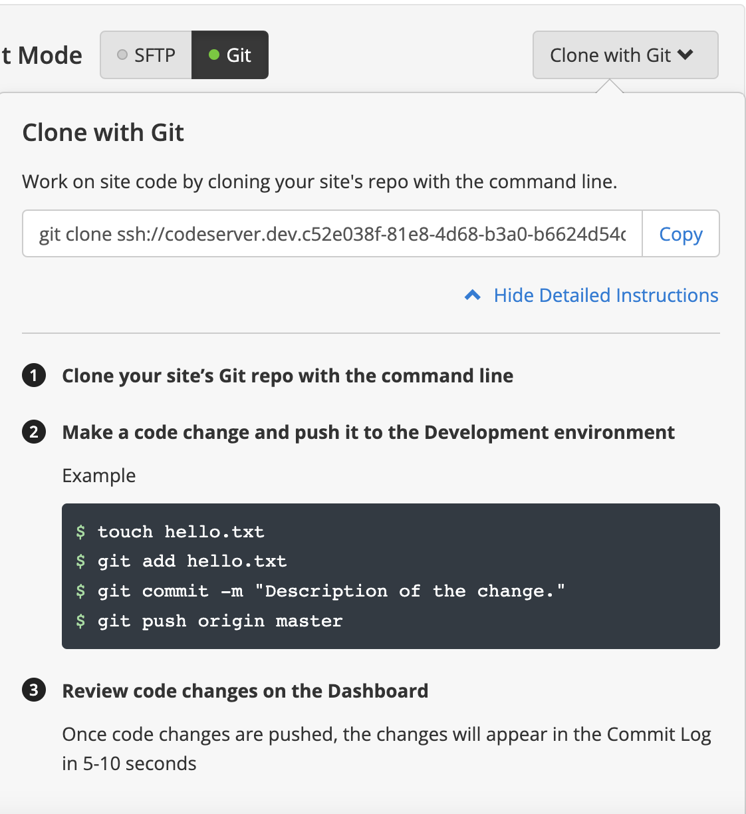

# Web development using CMS: Frontend (React) and Backend (wordpress.org)
## I. FRONTEND
***
### 1. Clone the repository to your computer:
 - go to [Github](https://github.com/HannaTylna/wp_exam_frontend) and copy the link:

 - open a terminal (t.ex. Powershell - Windows, iTerm - Mac OS) on your computer and navigate to the desired repository. Write the following command:
  ```
  git clone https://github.com/HannaTylna/wp_exam_frontend.git
  ```
 - navigate to the repository:
    ```
    cd your-local-repository
    ```
    and open code in VS Code
    ```
    code .
    ```
***
### 2. Run code in VS Code 
 - run the following command to install the packages:
    ```
    npm install
    ```
 - create .env file in the root of the project and create environment secrets REACT_APP_API_URL, REACT_APP_API_USERNAME, REACT_APP_API_PASSWORD (t.ex. REACT_APP_API_URL="https://dev-YOUR_SITE_NAME.pantheonsite.io/wp-json/"; REACT_APP_API_USERNAME="YOUR_USERNAME_TO_WORDPRESS" (Pantheon) and REACT_APP_API_PASSWORD="YOUR_PASSWORD_TO_WORDPRESS"(Pantheon) . I will describe how I created it in the Backend part);
    - you need to check if .env file is in .gitignore;

 - type the following command in your terminal to run the React project:
  ```
  npm start 
  ```
 - the website will open in browser;
 - prepare the code for pushing to Github repo:
  ```
  git init
  git add .
  git commit -m "Initial commit"
  ```
***
## 3. GitHub:
 - create a new repository on GitHub;
 - push code from your computer (VS Code) to GitHub:
  ```
  git remote add origin https://github.com/USERNAME/YOUR_REPO.git
  git branch -M main
  git push -u origin main
  ```
 - create the necessary Environment secrets that are in the .env file locally (REACT_APP_API_URL, REACT_APP_API_PASSWORD, REACT_APP_API_USERNAME) (Settings => Actions => New repository secrets)
***
## 4. Deployment

 - create an account here: [Vercel](https://vercel.com/);
 - add a new project by importing from GitHub;
 - configure project:
   - enter project name and create necessary environment variables (REACT_APP_API_URL, REACT_APP_API_PASSWORD, REACT_APP_API_USERNAME)
   - press the button Deploy
***
# II. BACKEND

### 1. Pantheon registration:
 - go to [Pantheon](https://dashboard.pantheon.io/);
 - create free account;

### 2. Website creation:
 - go to Home menu and choose Create New Site;
 - choose Wordpress;
 - fill in the required information;
 - sign up for Wordpress;
 - now you can create your website in Wordpress;
 - you need to remember to commit changes in Pantheon;
 - it is also important to control the Development Mode in Pantheon. If you switch it to Git you can't install plugins or themes in Wordpress. It must have SFTP (Development Mode). 

### 3. Changes to Wordpress files:
 - you can download (clone) files from Pantheon (Sites => Dev => Code => Development Mode (Git) => Clone with Git)
   - you need to generate SSH key in your computer, if you haven't done it before ([Windows](https://docs.tritondatacenter.com/public-cloud/getting-started/ssh-keys/generating-an-ssh-key-manually/manually-generating-your-ssh-key-in-windows) / [Mac](https://docs.tritondatacenter.com/public-cloud/getting-started/ssh-keys/generating-an-ssh-key-manually/manually-generating-your-ssh-key-in-mac-os-x))
 - you need to follow the instructions when you do any local changes in your project:
  
 - don't forget to deploy changes after pushing;
 - if you add members to your project team they may also Clone files, change them and push them back;
 - now you can use website's url to fetch data in React. T.ex, https://dev-YOUR_SITE_NAME.pantheonsite.io/wp-json/wp/v2/posts.